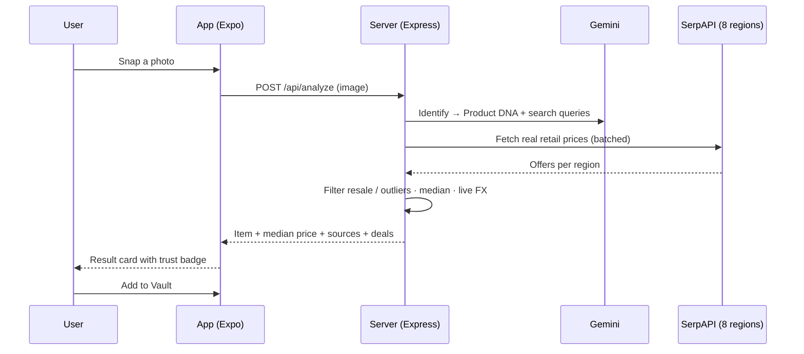
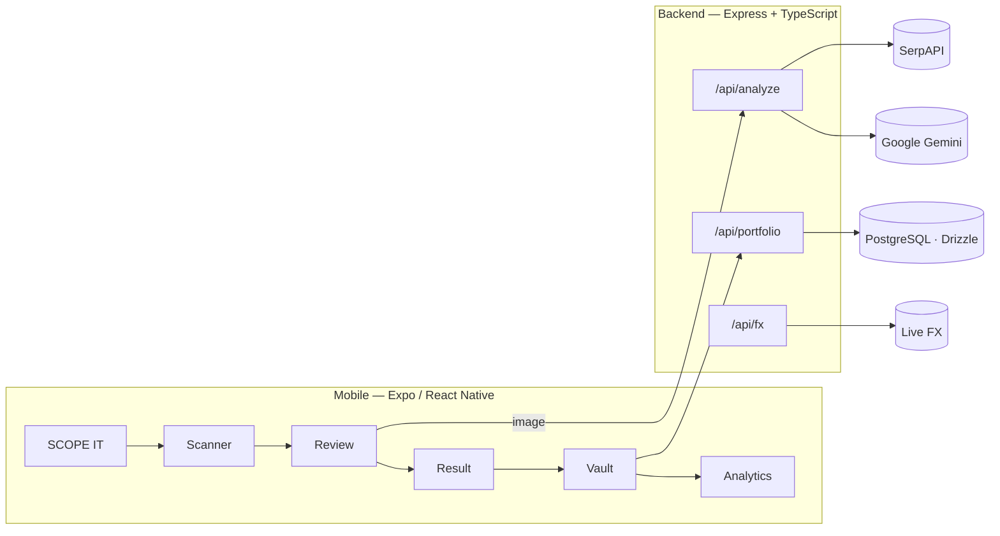

<p align="center">
  
</p>

<h1 align="center">SCOPE</h1>

<p align="center">
  <strong>Point your camera at anything. Know its real price.</strong><br/>
  An AI product scanner that identifies any object and compares real retail prices across 8 regions.
</p>

<p align="center">
  
  
  
  
  
  
</p>

---

## What is SCOPE?

SCOPE turns your camera into a universal price oracle. Snap a photo of **anything** —
a phone, a laptop, a vape, a handbag, a pair of sneakers, an appliance — and SCOPE:

1. **Identifies it** with a multi-modal AI pipeline (Google Gemini) that classifies the
   category first, then extracts brand, model and the variant details that move the price.
2. **Finds the real price** by querying live retail listings across **8 regions**
   (🇺🇸 🇬🇧 🇨🇳 🇹🇷 🇮🇹 🇪🇸 🇫🇷 🇦🇪), filtering out second-hand noise and outliers, and
   showing a **median backed by N real sources** — never a fabricated number.
3. **Tracks it** in a synced **Vault** with net-worth, gain/loss and category analytics.

> The whole experience is built around a single, cinematic call-to-action: **SCOPE IT**.

---

## ✨ Features

| | |
|---|---|
| 📸 **Universal recognition** | Category-first AI — electronics, vehicles, fashion, bags, footwear, watches, appliances, collectibles. Never forces a luxury brand onto a generic object. |
| 💵 **Real prices only** | Live multi-region retail prices via SerpAPI. New/retail focus (resale platforms filtered). If no real price exists, it says so — and offers a search link instead of a guess. |
| 🛡️ **Trust by design** | IQR outlier rejection, a minimum-sources threshold, and a “median of N live prices · date” badge on every result. |
| 🔭 **Confidence-scored DNA** | Each scan produces a structured *Product DNA* (brand, model, variant, condition) with visual/OCR confidence scores. |
| 🗄️ **The Vault** | Save scans into a portfolio with net worth, ROI, value-history charts and analytics. Offline-first with a retry queue and robust delete sync. |
| 🌍 **8 regions, one currency** | Prices normalized to USD with **live FX rates**, shown per country. |
| 🎨 **Premium, AI-native UI** | Dark cinematic canvas, Inter typography, fluid motion, skeleton loading, full accessibility labels. |
| 🔒 **Responsible** | Age-restricted items (vape, alcohol, weapons) are gated; ratings use price-fairness language, never financial advice. |

---

## 🧭 How it works



## 🏗️ Architecture



---

## 🧱 Tech stack

| Layer | Technology |
|-------|-----------|
| **Mobile** | Expo (React Native), React Navigation, TanStack Query, react-native-svg, Reanimated |
| **Language** | TypeScript (`strict`) end-to-end |
| **Backend** | Express 5, Helmet, rate-limiting, Zod validation |
| **AI** | Google Gemini (multi-modal, model-fallback chain) |
| **Pricing** | SerpAPI (Google Shopping, 8 regions) + live FX |
| **Data** | PostgreSQL + Drizzle ORM |
| **Quality** | Vitest, ESLint, Prettier, typed CI checks |

---

## 🚀 Getting started

**Requirements:** Node 20+, the [Expo Go](https://expo.dev/go) app on your phone, and a
free [Google Gemini API key](https://aistudio.google.com/apikey). Phone and computer on the
same Wi-Fi.

```bash
# 1. Install
npm install

# 2. Configure
cp .env.example .env
#    then set GEMINI_API_KEY=...   (other keys are optional)

# 3. Run backend + Metro bundler
npm run server:dev      # Express API (port 4000)
npm run expo:dev        # Expo — scan the QR with Expo Go
```

Then open SCOPE on your phone, tap **SCOPE IT**, and scan something.

> A detailed, step-by-step setup guide (Turkish) lives in [`KURULUM.md`](KURULUM.md).

### Environment

| Variable | Required | Purpose |
|----------|:--------:|---------|
| `GEMINI_API_KEY` | ✅ | AI product recognition |
| `SERPAPI_KEY` | – | Real multi-region prices (falls back gracefully) |
| `DATABASE_URL` | – | Cloud portfolio sync (local-only without it) |
| `XIMILAR_API_KEY` / `CLARIFAI_API_KEY` | – | Extra vision signals |
| `POSTHOG_KEY`, `AMAZON_AFFILIATE_TAG`, … | – | Telemetry / monetization (optional) |

---

## 📁 Project structure

```
client/          Expo React Native app
  screens/         Home · Scanner · Review · Confirm · Analyzing · Result · Vault · Analytics · AssetDetail
  components/      Reusable UI (ScopeBackground, ValueCard, TrendPill, Skeleton…)
  hooks/           usePortfolio (React Query data layer)
  lib/             image-store, quota, rating, query-client
  constants/       theme (Inter type system + color tokens)
server/          Express + TypeScript API
  routes.ts        /analyze · /portfolio · /valuate · /fx
  serpapi.ts       multi-region price search
  fx.ts            live exchange rates
  telemetry.ts     scan analytics
shared/          Drizzle schema shared by client & server
```

---

## 🧪 Scripts

```bash
npm run check:types   # TypeScript (client + server)
npm test              # Vitest unit tests
npm run lint          # ESLint
npm run db:push       # Apply Drizzle schema
```

---

## 📜 License

Released under the MIT License — see [`LICENSE`](LICENSE).
